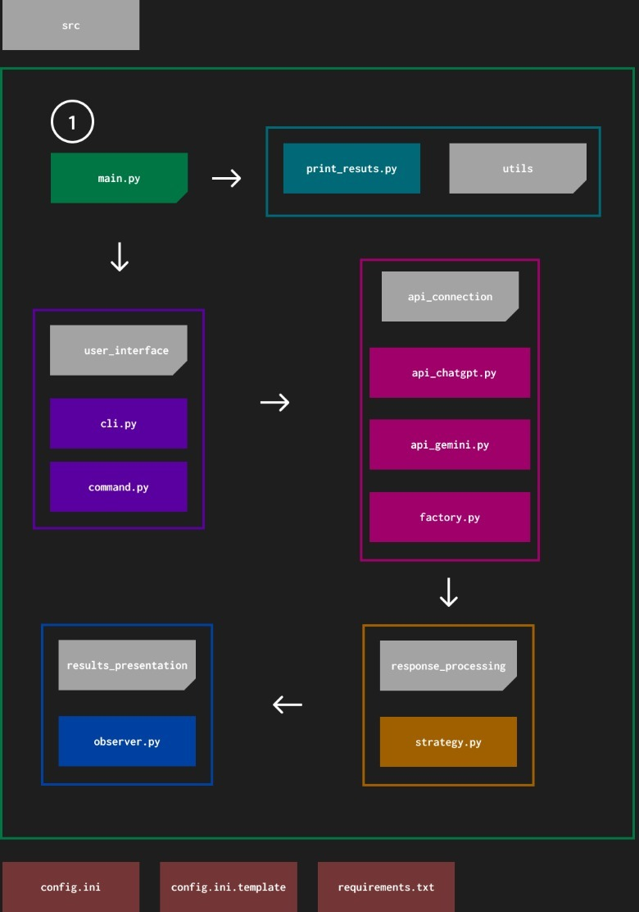

# Sistema de Integração e Avaliação de LLMs

<p align="center">
     
    
    
</p>


## Visão Geral

Esta aplicação Python conecta-se às APIs do ChatGPT e Gemini para gerar, avaliar e apresentar resultados.

## Funcionalidades

1. **Integração com APIs**:
   - Conecta-se ao ChatGPT e ao Gemini.
   - Utiliza o padrão [Factory](https://refactoring.guru/design-patterns/factory-method) para abstrair a criação de conexões com APIs.

2. **Interface de Linha de Comando (CLI)**:
   - Permite aos usuários enviar perguntas para os modelos.
   - Utiliza o padrão [Command](https://refactoring.guru/design-patterns/command) para encapsular solicitações.

3. **Processamento de Respostas**:
   - Avalia respostas utilizando algoritmos baseados no padrão [Strategy](https://refactoring.guru/design-patterns/strategy).
   - Suporta diferentes estratégias de avaliação.

4. **Apresentação dos Resultados**:
   - Exibe resultados com explicações.
   - Utiliza o padrão [Observer](https://refactoring.guru/design-patterns/observer) para notificar os usuários sobre mudanças.

## Instalação

### Pré-requisitos

- Python 3.8+
- Bibliotecas necessárias (veja [`requirements.txt`](./requirements.txt))

### Configuração

1. **Clone o repositório**:

    ```bash
    git clone https://github.com/owhenrique/sinerji-python-llm-owhenrique
    cd sinerji-python-llm-owhenrique
    ```

2. **Instale as dependências**:

    ```bash
    pip install -r requirements.txt
    ```

4. **Configure o arquivo de configuração**:

    Crie um arquivo `config.ini` no diretório raiz com o seguinte conteúdo:

    ```ini
    [API_KEYS]
    GEMINI_API_KEY = sua_chave_api_gemini
    CHATGPT_API_KEY = sua_chave_api_chatgpt
    ```

## Uso

### Interface de Linha de Comando

Para enviar uma pergunta aos modelos e avaliar as respostas:

1. **Usando a estratégia de contagem de palavras**:

    ```bash
    python main.py "Qual é a diferença entre IA e aprendizado de máquina?"
    ```

2. **Usando a estratégia de presença de palavras-chave**:

    ```bash
    python main.py "Explique o aprendizado profundo." --strategy keyword_presence --keywords "aprendizado profundo" "redes neurais"
    ```

### Estratégias Disponíveis

- **word_count**: Avalia com base no número de palavras na resposta.
- **keyword_presence**: Avalia com base na presença de palavras-chave especificadas.

## Diagrama de Pacotes



## Estrutura do Código

### `api_connection/`  

- `api_chatgpt.py`: Contém a implementação para a API do ChatGPT.
- `api_gemini.py`: Contém a implementação para a API do Gemini.
- `factory.py`: Define a interface abstrata para modelos de linguagem e implementa métodos de fábrica para criar instâncias de LLM.

### `response_processing/`

- `evaluation_strategies.py`: Define a interface de estratégias de avaliação.
- `strategies`: Contém implementações específicas das estratégias de avaliação.

### `results_presentation/`
- `observer.py`: Implementa o padrão Observer para notificação de resultados.

### `user_interface/` 

- `cli.py`: Gerencia a interface de linha de comando.
- `command.py`: Define o método command contendo uma classe específica para executar comandos e outra para enviar um prompt a um LLM específico e avaliar a resposta.

### `utils/`
- `result_print.py`: Possui uma função responsável por imprimir os resultados do prompt enviado pelo usuário. 

- `main.py`: O ponto de entrada da aplicação.

## Testes

1. **Executar testes**:

    ```bash
    pytest/diretório/arquivo_tests.py
    ```

## Contribuindo

1. Faça um fork do repositório.
2. Crie uma nova branch (`git checkout -b feature/SuaFeature`).
3. Faça commit das suas alterações (`git commit -am 'feat:Adicionar nova feature'`).
4. Envie para a branch (`git push origin feature/SuaFeature`).
5. Crie um novo Pull Request.

## Apresentação

<p align="center">
  <a href="https://www.youtube.com/watch?v=WJoGCNnW29g">
    
  </a>
</p>

 - [link para a apresentação](https://www.youtube.com/watch?v=WJoGCNnW29g)

## Licença

Este projeto está licenciado sob a Licença MIT.
